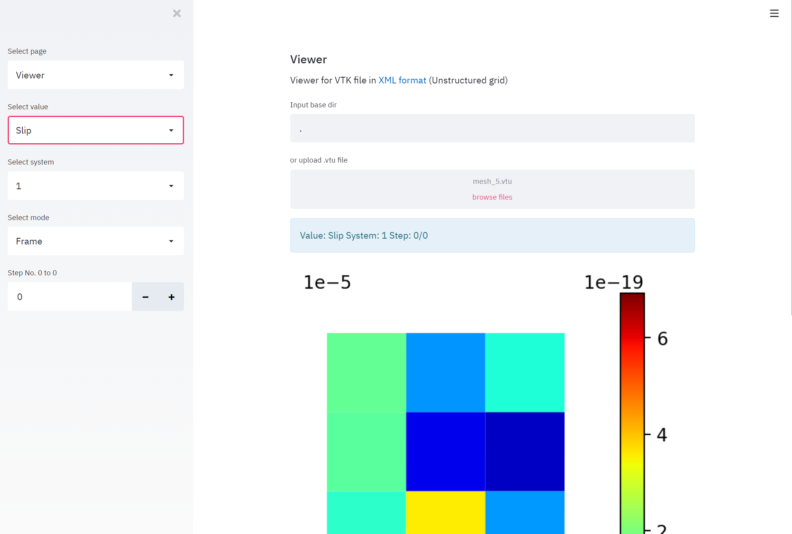
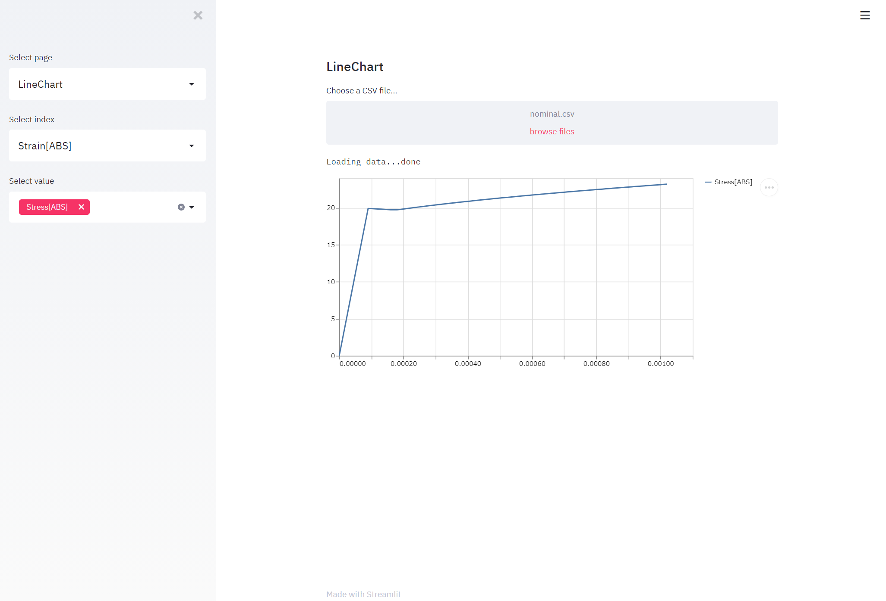

# Simple viewer for FE analysis
A simple web app to show results of FE analysis [[Sample page](https://viewer-fem-st.herokuapp.com/)]

## Usage

```bash
$ streamlit run app.py
```

## Screenshots

| Vtk viewer | Line chart |
|:---:|:---:|
|  |  |
